# Project Report

## Administrative information

### Team
Berthouzoz Michael, mberthouzoz, Documentation & coordination

Schowing Thibault, ThibaultSchowing, Tester

Widmer Yannick, younTheory, Service & Model

Zuckschwerdt Benoit, xajkep, User interface

### Tasks realized by the different team members
Generate scaffolding of the application.

Create each view, model, controller.

Implementation of the communcation with the database

Implemenation of the webservice rest

Define the "Gamification"

## Introduction
This project is to make during the AMT course at the HEIG-VD.

The main goal is to design an web application client-server in Java in 3 parts.

The first part is to create the scaffolding of the application (Account, Application, Role, Api Key) and implementation of the design pattern MVC.

The second part is to create the gamification domain model. This is where we will have to define and implement game mechanisms (e.g. badges, reputation scores, leader boards, etc.). This is also where we will have to find a ways to make a connection between

The third part is to

## User Guide

Prerequisite :
* Clone the Project
	* git@github.com:xajkep/Teaching-HEIGVD-AMT-2015-Project.git
* Install MySQL server
* Configure MySQL server
	* Create "amt" database
	* User amt must be connect to amt
	* User amt must have amt like password
* Create Glassfish server
	* Server : Glassfish
	* Name : AMT Server
	* Location : default
	* Domain : default
	* Host : localhost
	* Port : default

At startup, the application generate some data and save to database.
* 2 roles
	* Admin
	* User
* 2 accounts
	* toto@contoso.com, Toto, Smith, 12345, Admin
	* bob@contoso.com, Bob, Lenon, 54321, User
* 4 applications
	* app1, testapp1, toto
		* 25 end users
	* app2, testapp2, bob
		* 30 end users
	* app3, testapp3, toto
		* 20 end users
	* app4, testapp4, toto
		* 15 end users
* 90 end users
* 2 badges for Application 1
* 3 badges for Application 2
* endUser10 has
	* 1 badge
	* 1500 points
* endUser30 has
	* 3 badges
	* 3000 points

### How to execute and access the application
Prerequisite :
* The MySQL server must be started.
* The Glassfish server must be started.

**Netbeans**

1. Open Netbeans and open the project
2. Run the project (The application is started in your browser)

### How to use the application

Prerequisite :
* The application must be started
* The Glassfish server must be started.

1. Open your browser
2. Go to http://localhost:8080/AMT_Projet_Untitled/

### How to update, build and deploy the application
**Netbeans**:

Prerequisite :
* The MySQL server must be started.
* The Glassfish server must be started.

1. Open Netbeans and open the project
2. Change the part as you wish
3. Build the project (Run -> Build Project)
4. Deploy the project (Run -> Run Project)

### How to run the automated test procedure
**Selenium**:

Prerequisite :
* The main application must be launched.

1. Open Netbeans and open the ProjectTest
2. Build the project (Run -> Build Project)
3. Run the project (Run -> Run Project)

The tests are launched.

**JMeter**:

Prerequisite :
* The main application must be launched.

1. Open JMeter
2. Open the "AMT_Test_charge.jmx" file in JMeter
3. Run the automated test by clicking the green arrow

**NodeJS Test**

Prequrequisite :
* Make npm install in TestsNodeClient
* Set the api key at line 43.

1. Open a shell
2. Go to TestNodeClient folder
3. node client.js

## Design

### System overview
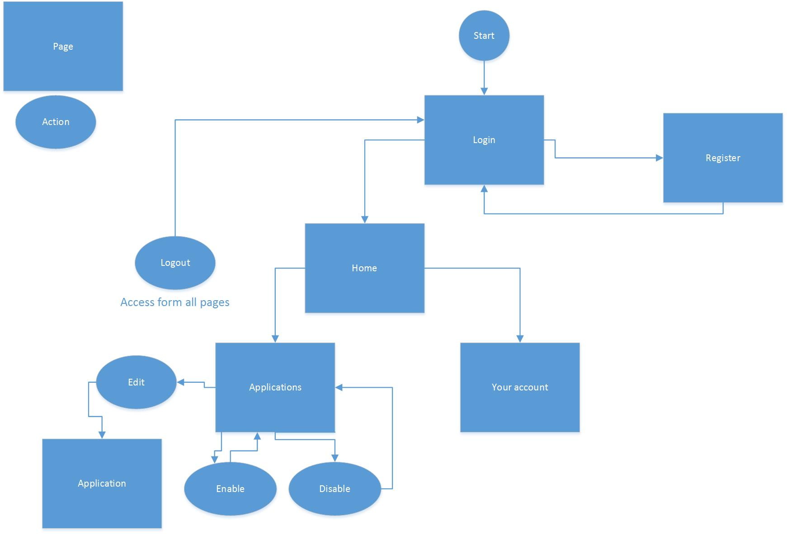
<caption>Navigation schema</caption>

### Model Schema
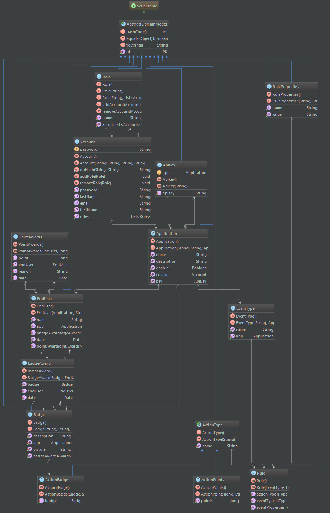
Model schema

### Dependence Model Schema
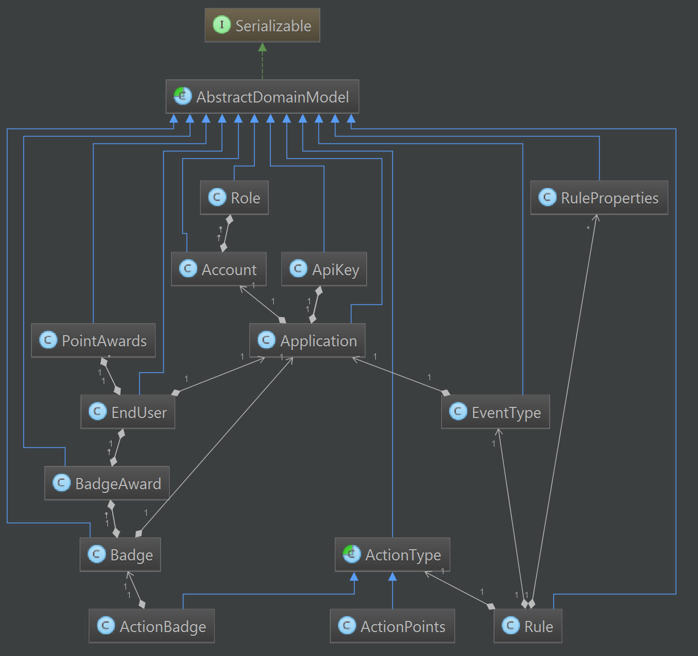
Dependence schema

### Gamification
The end user can earn :
 - Badges
 - Points

The end users appear in a ranking (leaderboard).

For the REST API we use the approach

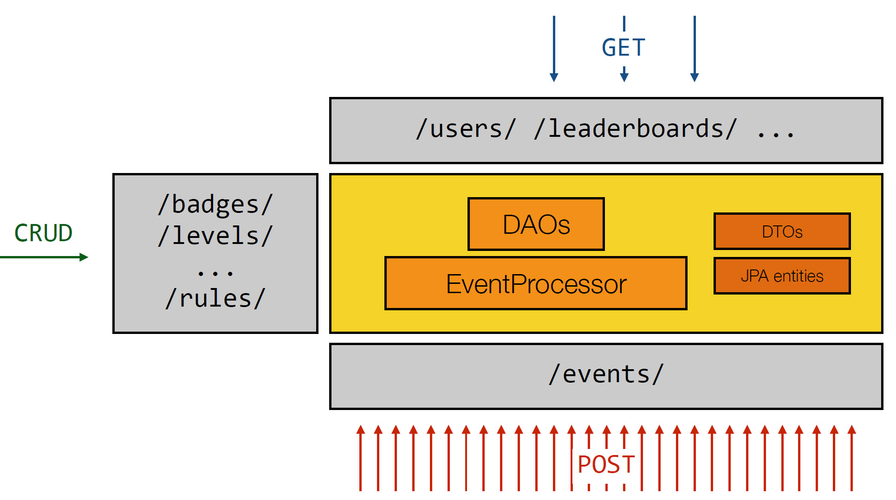

### User interface
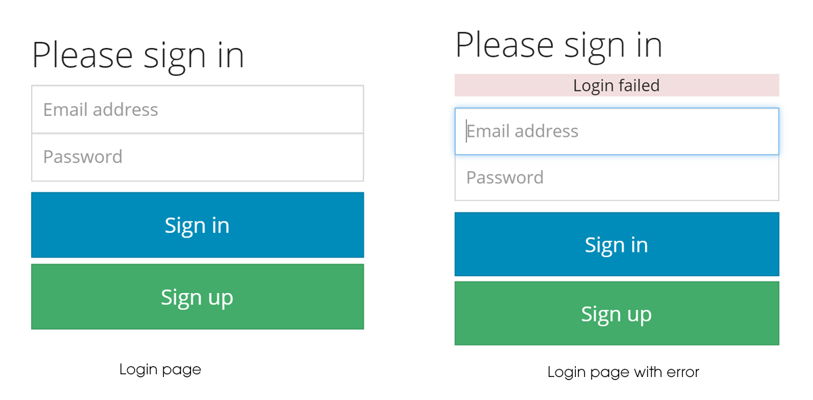
Login page

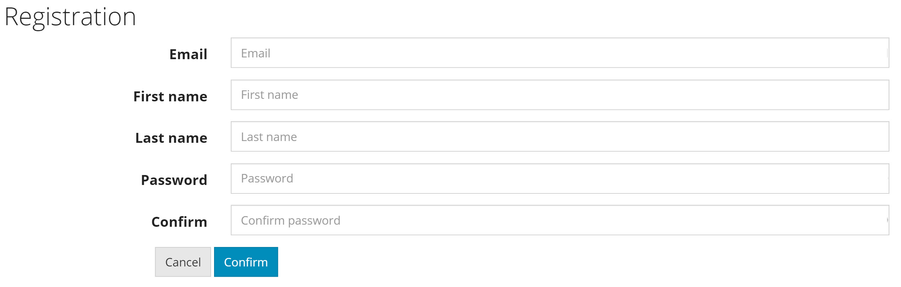
Register page

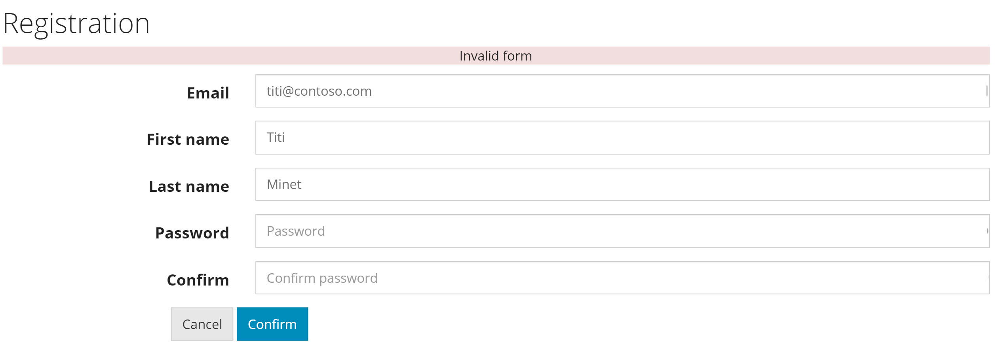
Error register page

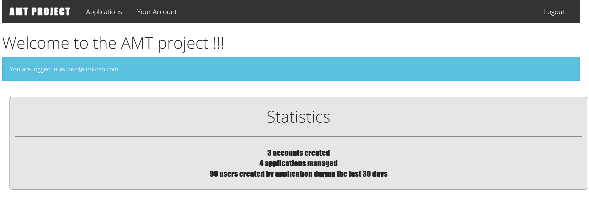
Home page

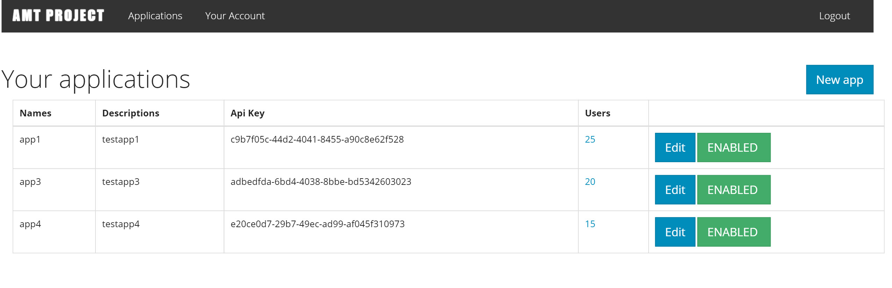
Application page

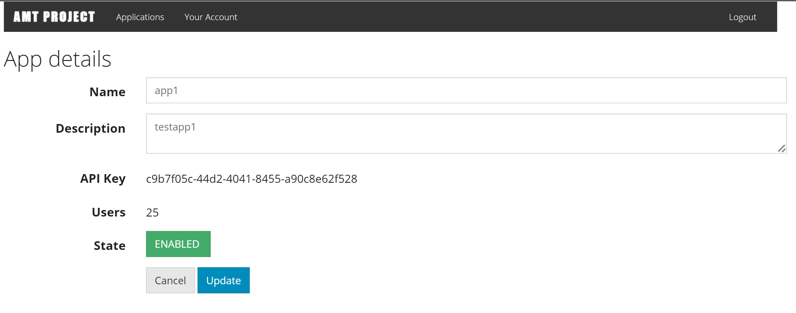
Edit application page

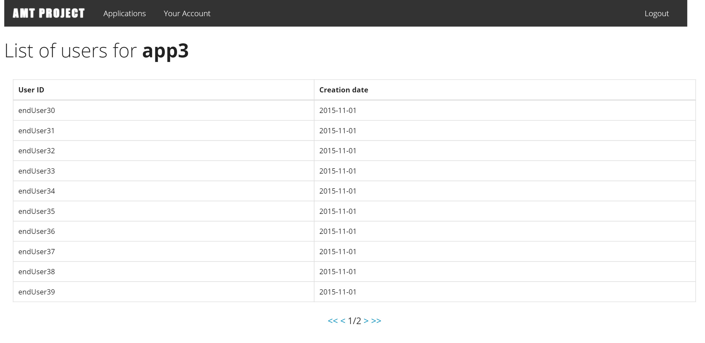
Userlist page

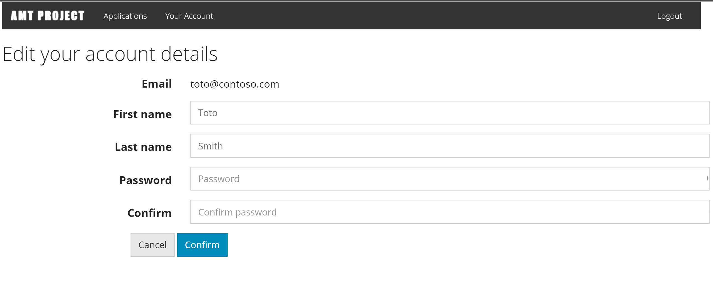
Edit account page

### REST API
[Specifications](../specifications/api-rest-spec.md "Specifications")

### Design patterns
#### MVC
This design pattern separate the code used for presentation from that which works on and handles data

The controller (which is often a Java servlet) oversees the whole application, calling code in the model (often a JavaBean) to handle the internal logic and business rules and then sending the results to the presentation layer, the view (often made up of JSPs), which interacts with the user.

Model: Implements the data crunching of the application. This is the core code that does the application’s internal work. The model doesn’t know anything about the view or the controller — you just pass it data and it goes from there, returning its results. In online Java applications, the model is often implemented using JavaBeans.

View: Implements the presentation layer that interacts with the user. When the user starts interacting with an online Java application, the Web page(s) they see are part of the view. The view also takes data supplied to it (usually from the controller) and displays it. In online Java applications, the view is often implemented using JSP.

Controller: Acts as the boss of the application and is responsible for routing data to the right model and view components. The controller oversees the model and the view by reacting to the data the user sends. In online Java applications, the controller is often implemented as a servlet.

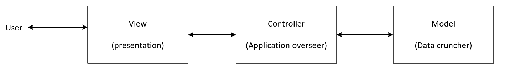
<caption>MVC schema</caption>

### Database

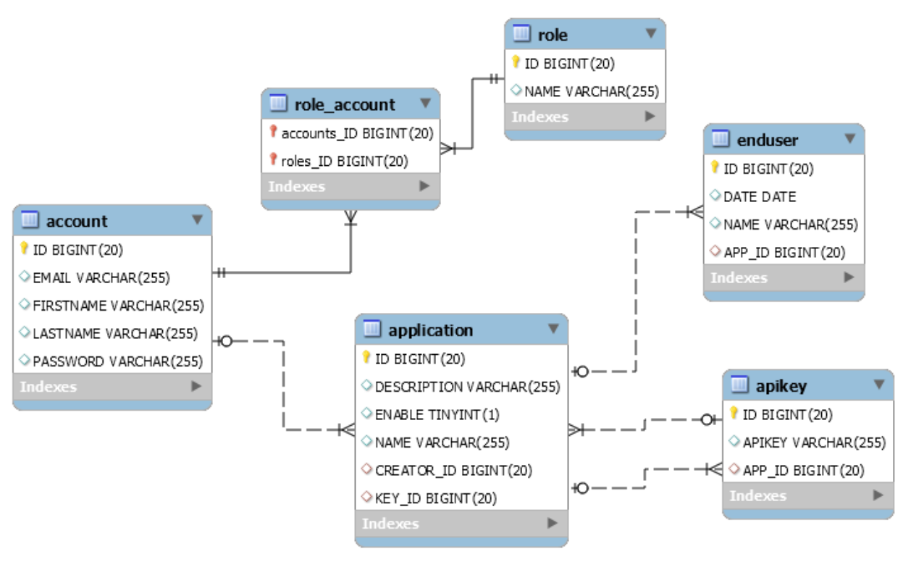
<caption>Database schema</caption>

The password isn't stored in clear, he is hashed.

## Implementation

### Package structure
Project

- Web Pages
	- WEB-INF
		- pages
			- includes
				- footer.jsp
				- header.jsp
			- home.jsp
			- login.jsp
			- app.jsp
			- register.jsp
			- app_edit.jsp
			- app_new.jsp
	- static
		- css
			- amt_project.css
			- bootstrap.min.css
			- signin.css
		- fonts
			- glyphicons-halflings-regular.eot
			- glyphicons-halflings-regular.svg
			- glyphicons-halflings-regular.ttf
			- glyphicons-halflings-regular.woff
			- glyphicons-halflings-regular.woff2
		- js
			- bootstrap.min.js
			- jquery.min.js
	- index.jsp
- Source Pakages
	- ch.heigvd.amt.amt_project.models
		- AbastractDomainModel.java
		- Account.java
		- ActionBadge.java
		- ActionPoints.java
		- ActionType.java
		- ApiKey.java
		- Application.java
		- Badge.java
		- BadgeAward.java
		- EndUser.java
		- EventType.java
		- pointawards.java
		- Role.java
		- Rule.java
		- RuleProperties.java
	- ch.heigvd.amt.amt_project.rest
		- config
			- AppConfig.java
			- JacksonConfiguration.java
			- JsonExceptionMapper.java
		- dto
			- ActionTypeDTO.java
			- BadgeDTO.java
			- EndUserDTO.java
			- EndUserReputationDTO.java
			- EventDTO.java
			- EventTypeDTO.java
			- LeaderboardDTO.java
			- PointAwardDTO.java
			- RuleActionDTO.java
			- RuleConditionDTO.java
			- RuleDTO.java
		- resources
			- BadgeResource.java
			- EventResource.java
			- LeaderboardResource.java
			- PointAwardsResource.java
			- RuleResource.java
			- UserResource.java
	- ch.heigvd.amt.amt_project.services
		- TestDataManager.java
		- TestDataManagerLocal.java
		- dao
			- AccountsDAO.java
			- AccountsLocalDAO.java
			- ActionBadgesDAO.java
			- ActionBadgesDAOLocal.java
			- ActionPointsDAO.java
			- ActionPointsDAOLocal.java
			- ApiKeysDA.java
			- ApiKeysLocalDAO.java
			- ApplicationsDAO.java
			- ApplicationsLocalDAO.java
			- BadgeAwardsDAO.java
			- BadgeAwardsDAOLocal.java
			- BadgesDAO.java
			- BadgesDAOLocal.java
			- BusinessDomainEntityNotFound.java
			- EndUsersDAO.java
			- EndUsersLocalDao.java
			- EventTypeDAO.java
			- EventTypeDAOLocal.java
			- GenericDAO.java
			- IGenericDAO.java
			- PointAwardsDAO.java
			- PointAwardsDAOLocal.java
			- RolesDAO.java
			- RolesAOoLocal.java
			- RulePropertiesDAO.java
			- RulePropertiesDAOLocal.java
			- RuleDAO.java
			- RuleDAOLocal.java
	- ch.heigvd.amt.amt_project.util
		- MonitoringListener.java
	- ch.heigvd.amt.amt_project.web.controllers
		- AccountServlet.java
		- AppServlet.java
		- AuthenticationServlet.java
		- HomeServlet.java
	- ch.heigvd.amt.amt_project.web.flters
		- SecurityFilter.java

### Selected aspects
The Bootstrap 3 library is used for designed the views.

## Testing and validation

### Tools
#### Apache JMeter
Apache JMeter is an open source software, a 100% pure Java application designed to load test client/server software.

JMeter can be used to simulate a heavy load on a server, network or object to test its strength or to analyze overall performance under different load types.

User's Manual : [http://jmeter.apache.org/usermanual/index.html](http://jmeter.apache.org/usermanual/index.html)

#### Selenium
Selenium is a portable software testing framework for web applications.

Selenium provides a record/playback tool for authoring tests without learning a test scripting language (Selenium IDE). It also provides a test domain-specific language (Selenese) to write tests in a number of popular programming languages, including Java, C#, Groovy, Perl, PHP, Python and Ruby. The tests can then be run against most modern web browsers. Selenium deploys on Windows, Linux, and Macintosh platforms. It is open-source software, released under the Apache 2.0 license, and can be downloaded and used without charge.

Documentation : [http://docs.seleniumhq.org/docs/](http://docs.seleniumhq.org/docs/)

### Test strategy

#### Automated piloting tests

Selenium will be used to simulate user actions such as:

* Login with wrong credentials. It should not work and the user should stay on the same page.
* Login with valid credentials. It should redirect the user to the homepage
* Once logged-in the user should join every pages on the website
* Once logged-in the user should be able to make CRUD operations on the applications.
* Once logged-in the user should be able to make modifications on his profile.

#### Automated heavy load test

JMeter will be used to simulate multiple simultaneous access to the website to check for eventual multi-thread bugs.
Here are the requests that will be executed for each thread:

* Get homepage
* Register random user
* Authentication of this random user
* Get application list
* Add a new application

#### REST API

We have a client in Javascript.
This program goal is to test the behaviour of the application with multiple parallel requests. This "client" will send multiple events to the gamification platform in order to increase the amount of points / badges of a client and then will ask the client how many points he has.

If the number of points are not equals on both sides (this node application and in the gamification platfomr) there is a problem (probably concurrency).

### Results

### Apache JMeter

The thread group of JMeter tests contains two views to visualize query results. The first, "View results tree" can see requests and responses sent and the other, "Graph Results", lets see the send-response time and other details on the flow, the average or data for example. Other views can be added without worries thread group.

The requests results can be seen in the database.

#### Selenium

When the Selenium project is implemented (in test mode), the NetBeans progress bar shows the percentage of green and red successful tests stranded results.

## Known Issues

## Conclusion
The development of this application is not easy because it lacks some concepts for some member of the group to effectively move forward. Separating the tasks (Model, Documentation, Controller / View, Test) do not help learning.

## Appending A: Auto Evaluation
