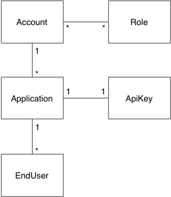
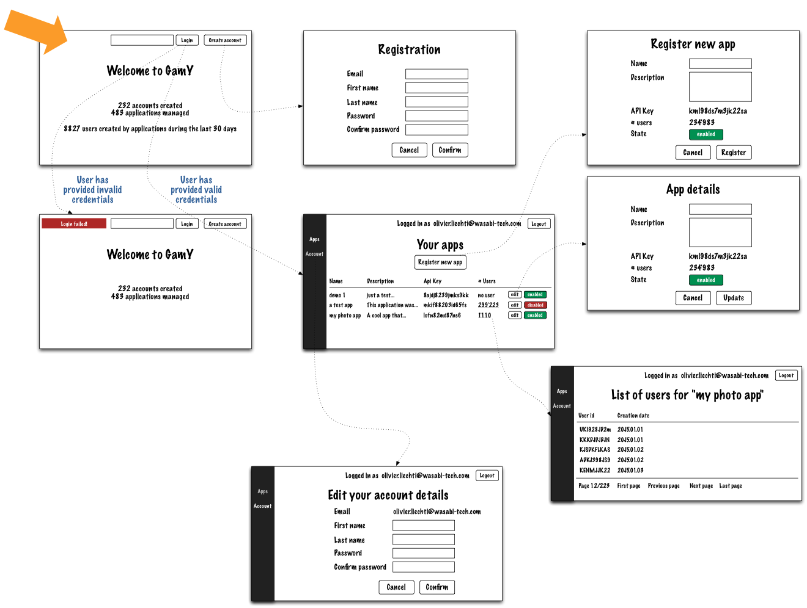

# Project specifications, Part 1

## Introduction

The first part of the project has two objectives. The first objective is to apply the technologies, techniques and design patterns presented during the course. The second objective is to implement the foundation of the gamification platform that will evolve during the semester.

After completing this part, you should have a working system in place. This system will provide limited functionality, but it should be tested and robust.

## Background: service platforms, APIs and developer accounts

Over the last decade, many companies have created platforms and services that they make available to developers via online APIs. Here are a couple of examples:

* [Twilio](https://www.twilio.com/) provides an API that allows you to easily integrate telephony and messaging features in your apps. The company manages the VoIP platform that enables these features.

* [Google Maps](https://developers.google.com/maps/) provides several APIs that allow you to develop mapping features in your applications.

* [Flickr](http://www.flickr.com/services/api/) provides an API that you can use to access the photo collections from your applications.

* Lots of other examples are available on [ProgrammableWeb](http://www.programmableweb.com/apis).

Most of these service providers operate in the same way. 

* As a developer, you need to **register an account** on their platform. 

* When you access your **account console**, you can **register one or more applications**. These are the applications that will use the provider API. 

* Each of these applications is assigned an **API key**. Later on, when the application makes a remote call to the API, it must provides the API key. This allows the service platform to **authenticate the application**.

* You create an application and make it available to **your users** (they are often called **end-users**). In some cases, the service platform will manage some data for each of your users (this will be the case for the gamification platform, where we will keep track of points and badges on the platform side). Usually, the client application does not communicate the real user identity to the platform. Instead, it communicates an opaque handle (instead of saying that olivier.liechti has earned a badge, it says that user #JHFJ782 has earned a badge).

## Features

* The system that you will build during the first phase must be able to **manage developer accounts**, **applications**, **API keys** and **end-users**.

* You will develop **business services** and **data access services** (applying the DAO design pattern) for these business objects.

* You will also implement a **Web UI** for the services, by applying the MVC design pattern.

## Domain model

The minimum domain model that you will implement is shown in the following diagram. Note the following elements:

* Every user of the gamification platform has an **account**. Most of the users are application developers (e.g. the stackoverflow developer using the gamification platform). However, the people running the gamification platform (the IT staff, the business people, etc.) are also users.

* For this reason, you will need to manage **roles** to differentiate the types of users and give access to the appropriate features (authorization). Every account can be assigned one or more roles.

* Every developer with an account on the platform can register one or more applications. Every application has an API key automatically assigned by the platform.

* The platform keeps track of end-users. Remember that the end-users are the users of the applications that use the gamification API.

We have not documented the attributes of the business entities. This is your responsibility (the UI mockups will give you hints).

## UI flow

The minimum UI that you will implement is shown in the following diagram. Note the following elements:

* Developers first arrive on the landing page. On this page, they see statistics about service usage (total number of developer accounts and of applications; number of end-users created during the last 30 days).

* From the landing page, they can enter their credentials. If they provide wrong credentials, they stay on the page and see an error message. If they provide valid credentials, they are redirected on the console page.

* On the console page, they can use a left navigation bar to access the platform features.

* They can go in the "Applications" section and find the list of their applications (a developer can register multiple apps). From the list, they can enable/disable an application (if an app is disabled, related API requests should be rejected). From this page, they can access a "details" page (where they can edit some of the attributes). They can also register a new app. Notice that these two screens are very similar, so you should find ways to factor your code.

* From the list of applications, they can also go to a page that shows the list of all end-users of a given app. Since there can be many end-users, the page must handle pagination.

* Developers can also access a page, where they can edit their account details. One of the things they can do is change their password. You should define a policy for acceptable passwords (length, required characters, etc.) and implement it. The policy should be applied when developers create their account and when they later change their password.

[image source](diagrams/part1-UI.png)

## Testing and validation

You will validate your implementation with the following test strategy:

* firstly, you will implement a method for **generating test data** (accounts, apps, etc.). Since you may not have a REST API at this stage, one strategy could be to implement a business service for that purpose.

* secondly, you will implement **automated user acceptance tests** with the tool of your choice (Selenium, selenium.io). To do that, you will first define a list of scenarios for how users interact with your web UI (arrive on the landing page, enter credentials, hit login button, etc.). You should define scenarios to validate different behaviors of your app (e.g. one scenario to validate what happens when wrong credentials are provided at login, one scenario to validate what happens when valid credentials are provided at login, etc.)

* thirdly, you will implement **performance and load testing** with JMeter. Again, you will define a number of scenarios. You will run the tests and most importantly, you will analyze and comment the results!

